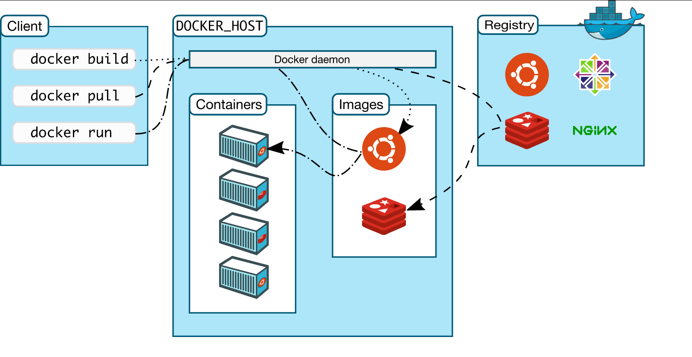

# Containerisation
- Allows code to be run on any Operating System
- Shares resources with local machine
- More lightweight and faster than VM's
## Containerisation Software
- Docker
- Rocket
## Docker
### What is Docker?
- Open source platform
- Enables us to separate applications from infrastructure
- Allows us to deliver software faster
- Written in GO (language)
- Containers are created from images
### Why learn Docker?
- Multi billion dollar companies are using or adopting Docker e.g. Ebay, Netflix,
Sky, and many more
- Docker adoption was anticipated to be 50% by the end of 2020
- Lightweight and user friendly
- Shares resources with OS as opposed to using the OS completely (as is the case
  with VM's)
- Docker engine connects the container with OS and only uses the resources required
- VM works with Hypervisor to connect guest OS/VM with Host OS/server

### Docker API

### DockerHub
- DockerHub repo required to see the container or image
- Wrapped up container can be pulled and ran on any OS

### Docker commands
**docker pull image_name**
- This pulls the image from a library and stores it on your local machine, allowing
it to be run
- To test that Docker has been installed correctly we can try and pull hello-world
with 'docket pull hello-world'

**docker images**
- This will show all of the images available, any images you have pulled should
show up here

**docker run image_name**
- This will run the chosen image
- You can run this command without pulling, as docker will check your local machine
for this image and if not found it will try to find it and pull it from the registry
- We can run our hello-world image with `docker run hello-world`. If everything
was successful, we should see a hello message telling us that the installation
is working correctly

**docker build -t image_name**
-

**docker commit image_name/container_id**
-

**docker start container_id**
- This starts a container that isn't currently running

**docker stop container_id**
- This stops a running container
- Changes made since it started are kept when stopping, and will persist when
started again

**docker rm container_id**
- Deletes a specified container
- This container will no longer be viewable with `docker ps` or `docker ps -a`
- Any changes made while it was running will not persist once removed even if
the container is run again

**docker ps and ps -a**
- With ps, this displays the currently running containers
- With ps -a, this displays all available containers whether they are currently
running or not

**docker exec -it container_id**
- This logs into a running container to edit its configuration or check the
environment

#### Flags
**-d**
- Used to run images in a detached mode
- This allows us access to the terminal for images that may take
control of it while running

**-p localhost_port:container_port**
- Used for port mapping

**-f**
- Used to force a command e.g. removing a container
### Logging into a running container
`docker exec -it container_id`
- On Windows this may give the following error "the input device is not a TTY.  If you are using mintty, try prefixing the command with 'winpty'"
- A way to fix this is to either add `winpty` before the command each time you
run it, or enter the following command `alias docker="winpty docker"` which will
allow it to work as long as this terminal is open
- To fix this permanently, you can create an environment variable so that this
mapping persists on any terminal
- Once logged into the container, you can change it's configuration
#### Copying in files from localhost to container
- The general syntax is `docker cp <source> <destination>` where the destination
will be the file path preceded by the container id/name and a colon
- An specific example could be `docker cp index.html ea35b31c13f4:usr/share/nginx/html/`
### Making docker docs available on our local host
`docker run -d -p 4000:4000 docs/docker.github.io`
- This will mean we can pull locally in the future instead of having to rely on
the internet
