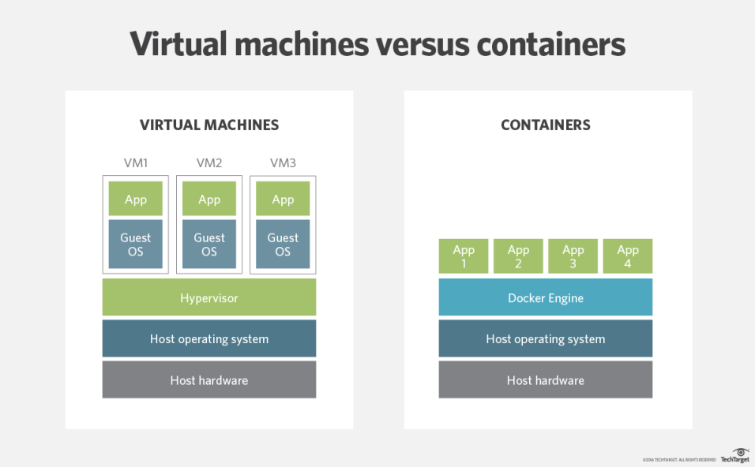

# Containerisation
- Allows code to be run on any Operating System
- Shares resources with local machine
- More lightweight and faster than VM's
## Containerisation Software
- Docker
- Rocket
## Docker
### What is Docker?
- Open source platform
- Enables us to separate applications from infrastructure
- Allows us to deliver software faster
- Written in GO (language)
### Why learn Docker?
- Multi billion dollar companies are using or adopting Docker e.g. Ebay, Netflix,
Sky, and many more
- Docker adoption was anticipated to be 50% by the end of 2020
- Lightweight and user friendly
- Shares resources with OS as opposed to using the OS completely (as is the case
  with VM's)
- Docker engine connects the container with OS and only uses the resources required
- VM works with Hypervisor to connect guest OS/VM with Host OS/server

### Demand and future of Docker
-
### Docker API
### DockerHub
- DockerHub repo required to see the container or image
- Wrapped up container can be pulled and ran on any OS

### How it works
